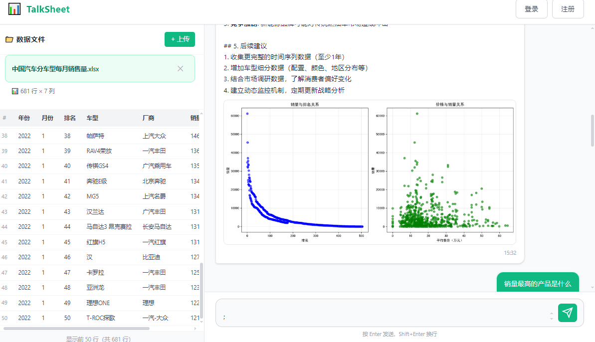
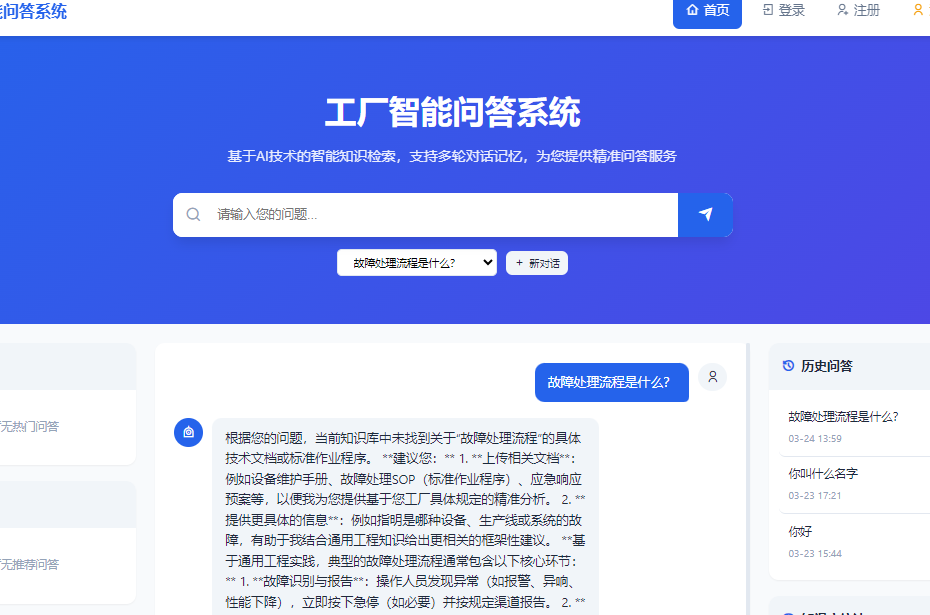
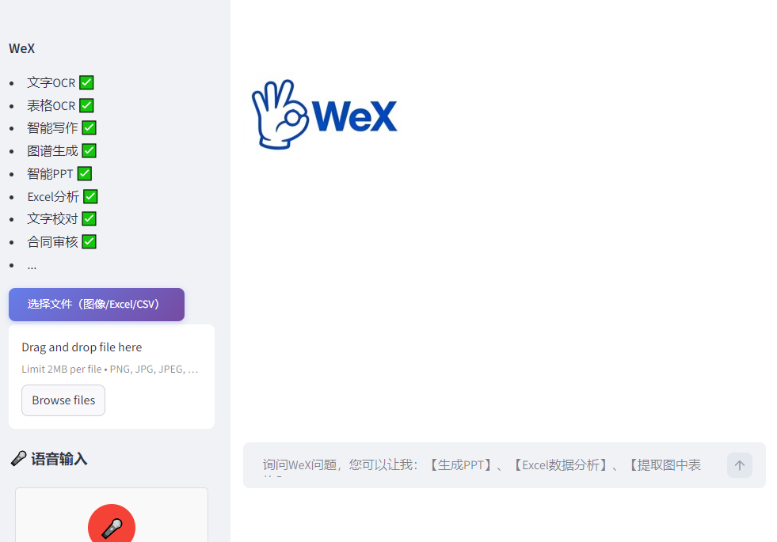

<!-- GitHub Stats -->

  

 

  
  
  

---

### Hi there 👋

- 🔭 I’m focused on **AI applications, RAG, Multi-Agent systems, and LLM deployment**
- 📝 My Blog: https://jiangnanboy.github.io
- 🌐 My Website: https://www.wexopen.com

### 🚀 Online Projects

- **TalkSheet**: https://www.talksheet.wexopen.com

- **RAG QA System**: https://www.rag.wexopen.com

- **Multi-Agent System**: https://www.office.wexopen.com

### 📫 Contact
- 📧 Email: 2229029156@qq.com
- 💬 WeChat: **番石榴AI**
- 📘 Zhihu: https://www.zhihu.com/people/jiangnanboy

---

### 💻 Tech

  
  
  
  
  
  
  

