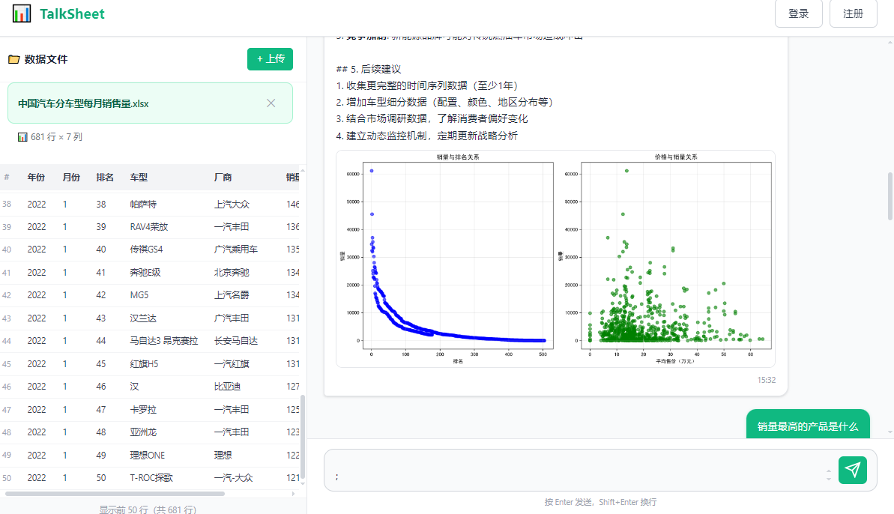
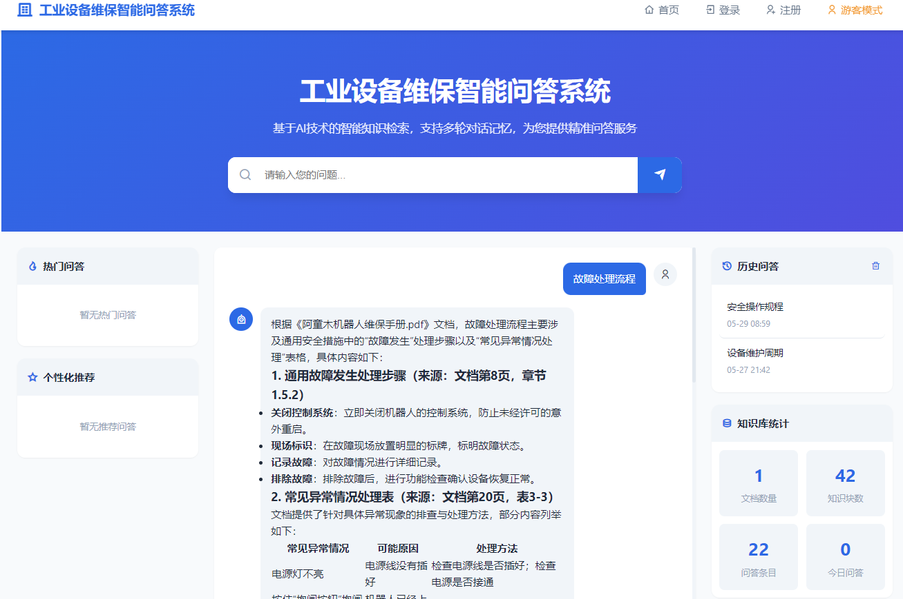
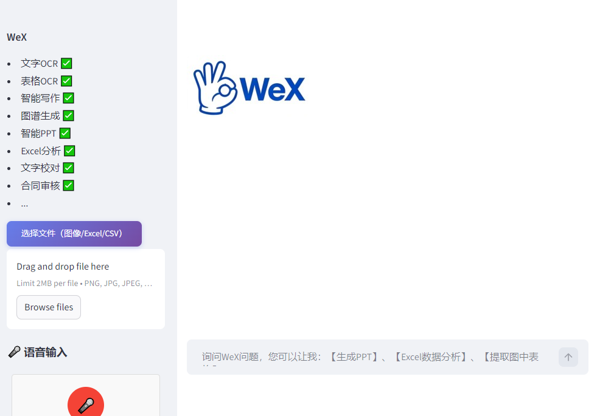

## 👋 Hello, I'm jiangnanboy
An AI application developer and explorer focused on **industrial landing of artificial intelligence**.
Currently, my core research and practice focus on **LLM application implementation, RAG question-answering, multi-agent systems, and lightweight model inference deployment**,
with rich practical experience in NLP, OCR, document intelligence and knowledge graph.

<!-- GitHub Stats -->

  

 

  
  
  

 

  

### 🔭 Core Focus
- 🤖 LLM / RAG / Multi-Agent Systems (LangChain & LangGraph)
- 📝 Natural Language Processing & Text Intelligence
- 🖼️ Document Image Processing & Computer Vision
- 📊 Data Mining, Search Engine & Personalized Recommendation
- 🧩 Knowledge Graph Construction & Intelligent Q&A

### 🌐 Personal Links
- 📚 GitHub : [jiangnanboy.github.io](https://jiangnanboy.github.io)
- 🌰 My Website: [wexopen.com](https://www.wexopen.com)
- 📘 Zhihu ：https://www.zhihu.com/people/jiangnanboy
- 📘 CSDN ：https://blog.csdn.net/qq_20182781 

## 🚀 Online Projects
| Project Name | Introduction | Online Address |
| :--- | :--- | :--- |
| TalkSheet Agent| Excel Intelligent Analysis Agent| https://www.talksheet.wexopen.com |
| RAG QA System Agent| Industrial Intelligent Q&A Agent| https://www.rag.wexopen.com |
| Multi-Agent Office System | Office collaborative intelligent agent platform | https://www.office.wexopen.com |

    
   
    
   
    

## 📦 Key Projects

### 🖥️ Desktop Software
| Project | Description |
| :--- | :--- |
| [OCR & Table Tool](https://www.wexopen.com/products/) | All-in-one OCR, table recognition, screenshot capture & export |
| [Video to PPT/PDF Converter](https://www.wexopen.com/products/) | Generate editable PPT from video with deduplication & clip extraction |
| [Document Comparison Tool](https://www.wexopen.com/products/) | Multi-format document contrast analysis & intelligent report generation |
| [Document Image Processor](https://www.wexopen.com/products/) | Image enhancement, distortion correction, shadow removal & edge cropping |

---

### Feature projects
| Project | Description |
| :--- | :--- |
| [RAGForge](https://github.com/jiangnanboy/RAGForge) | Modular, composable RAG retrieval library —— Build your retrieval pipeline like forging parts |
| [Chinese Text Corrector](https://github.com/jiangnanboy/jcorrector) | Practical open-source Chinese error correction toolkit |
| [Intelligent Medical KG](https://github.com/jiangnanboy/intelligent_medical) | Medical knowledge graph, symptom retrieval and diagnosis Q&A |
| [K12 Education Knowledge Graph](https://github.com/jiangnanboy/education_knowledge_graph_app) | Education-oriented KG visualization and knowledge reasoning |
| [OpenOCR4j](https://github.com/jiangnanboy/openocr4j) | Lightweight end-to-end document parsing |
| [JiaJiaOCR](https://github.com/jiangnanboy/JiaJiaOCR) | Pure Java self-developed OCR recognition engine |
| [Document Image Tool](https://github.com/jiangnanboy/Doc-Image-Tool) | Scanned document enhancement and batch optimization |
| [Learning to Rank](https://github.com/jiangnanboy/learning_to_rank) | Search sorting model optimization and algorithm practice |

---

### All projects
| Project | Description |
| :--- | :--- |
| [All projects](https://jiangnanboy.github.io) | Project Classification Details |

## 💻 Tech Stack Badges

  
  
  
  
  
  

## 📫 Contact
- 📧 Email: 2229029156@qq.com
- 💬 WeChat Official Account：番石榴AI
- 🐙 GitHub: https://github.com/jiangnanboy
